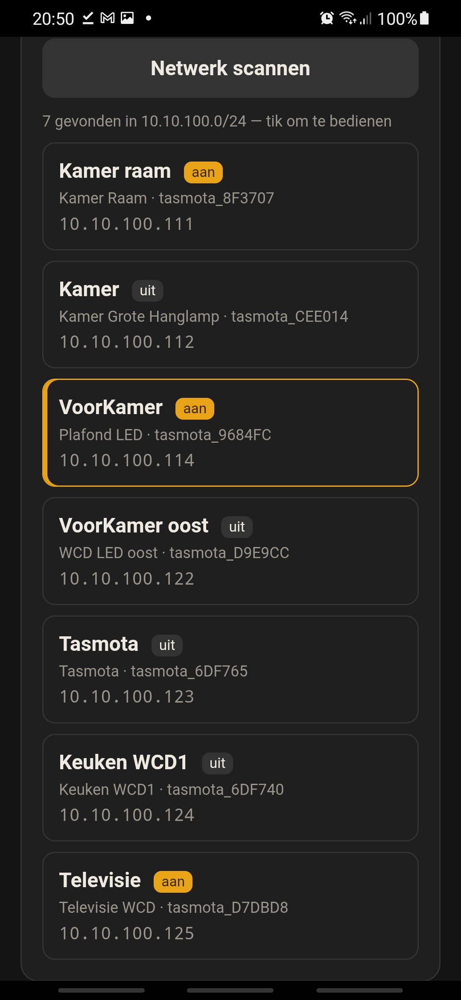
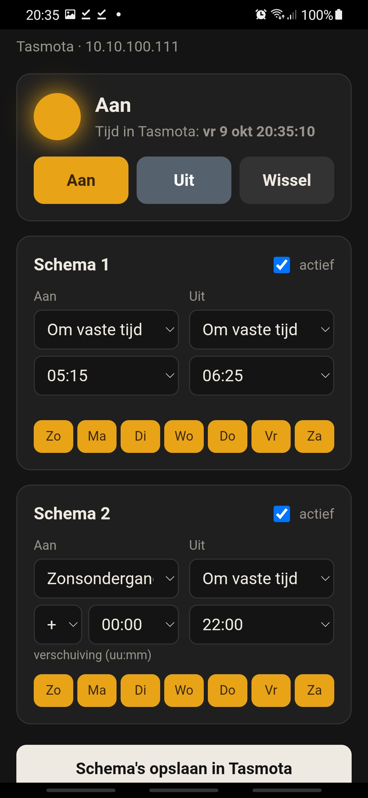
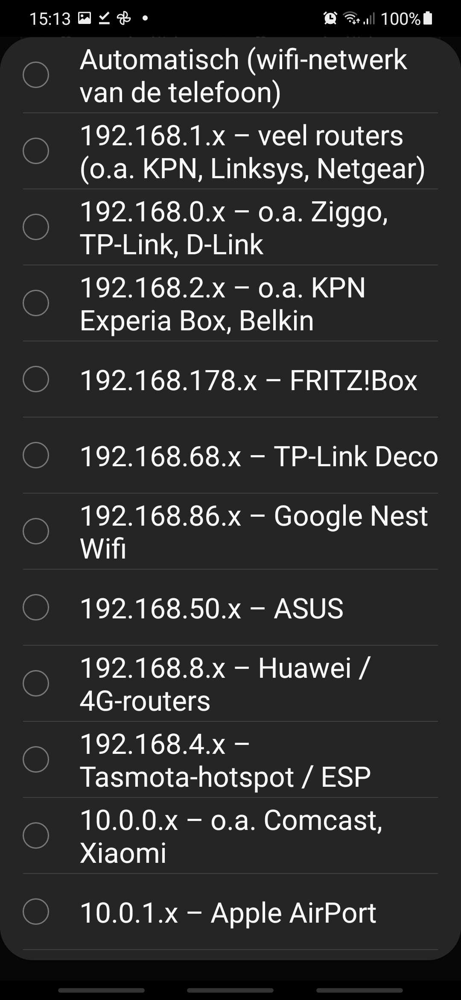
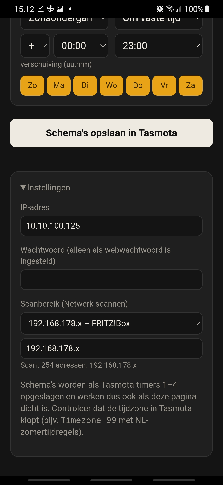

tasmota android app

find control timed tasmota wifi wall sockets

scan find control tasmota devices in local wifi network

scan network for tasmota wifi switches wall socket devices in +/- 2 seconds

control on off toggle

should i add countdown off?

      http://10.10.100.114/cm?cmnd=Backlog%20Power1%201%3B%20Delay%20600%3B%20Power1%200

set 2 on off timers

with or without suntimes

on off timers are saved in tasmota switch

android app made by claude.ai 

and build compiled by github


# Tasmota Android-app

Een kleine, snelle Android-app om **Tasmota-schakelaars** in je eigen wifi-netwerk te vinden en te bedienen.
Volledig lokaal: geen cloud, geen account, geen MQTT-server nodig.

> 🇬🇧 *A small Android app that scans your Wi-Fi for Tasmota devices and controls them locally: on/off, live device time, and two schedules (fixed time or sunrise/sunset) stored as native Tasmota timers.*

<p align="center">
  
  &nbsp;&nbsp;
  
</p>
<p align="center"><sub>Links: netwerkscan · Rechts: bediening en schema's</sub></p>

 

 

setting for wich ip range to scan

---

## Functies

- 🔍 **Netwerk scannen**: vindt in een paar seconden alle Tasmota's in je netwerk (`x.x.x.1–254`, 64 tegelijk).
  Per apparaat zie je de **FriendlyName**, **DeviceName**, het **topic**, het **IP-adres** en of hij **aan of uit** staat.
- 👆 **Tik om te bedienen**: kies een schakelaar uit de lijst. De app onthoudt hem.
- 💡 **Aan / Uit / Wissel** met live status.
- 🕒 **Tijd in Tasmota**: laat de klok van de schakelaar zien en waarschuwt als die afwijkt
  (bijvoorbeeld door een verkeerde tijdzone of zomertijd).
- 📅 **Twee schema's** met elk een aan- en een uit-moment:
  - op een **vaste tijd**, of
  - bij **zonsopkomst** of **zonsondergang**, met een verschuiving (bijvoorbeeld *zonsondergang − 00:30*),
  - en per dag van de week in of uit te schakelen.
- 💾 Schema's worden **in de schakelaar zelf** opgeslagen als Tasmota-timers 1–4.
  Ze blijven dus werken als je telefoon uit staat of de app dicht is.
- 🔒 Apparaten met een webwachtwoord worden herkend. Het wachtwoord stel je in onder *Instellingen*.

## Installeren

1. Ga naar het tabblad **[Actions](../../actions)** en open de nieuwste groene run.
2. Download onder **Artifacts** het bestand `PlafondLED-apk` en pak het uit. Je krijgt `PlafondLED.apk`.
   *(Of download hem bij **[Releases](../../releases)**, als die er staan.)*
3. Open de APK op je telefoon. Android vraagt eenmalig om toestemming voor *"onbekende apps"*.

> Vanaf versie 1.1 gebruikt de app een vaste ondertekeningssleutel, dus updates installeren over de oude versie heen.
> Kom je van versie 1.0, verwijder die dan eerst.

## Tasmota eenmalig instellen

Open de schakelaar in je browser → **Tools → Console** en voer in:

```text
Backlog Timezone 99; TimeStd 0,0,10,1,3,60; TimeDst 0,0,3,1,2,120
Backlog Latitude 52.70; Longitude 5.29
```

- De **eerste regel** zet de Nederlandse tijd met automatische zomer- en wintertijd. Zonder deze regel schakelen de timers een uur verkeerd.
- De **tweede regel** stelt je locatie in, die nodig is voor zonsopkomst en zonsondergang. Vul je eigen coördinaten in.

**Tip:** geef je schakelaars een vast IP-adres, buiten het DHCP-bereik van je router, zodat de app ze altijd terugvindt:

```text
Backlog IPAddress1 10.10.100.200; IPAddress2 10.10.100.1; IPAddress3 255.255.255.0; IPAddress4 10.10.100.1; Restart 1
```

## Hoe werkt het?

De bediening is een gewone HTML-pagina die in de app draait (een Android-WebView).
Een webpagina in een browser mag de antwoorden van Tasmota niet lezen, door **CORS**, en de standaard Tasmota-build kent het commando `CORS` niet.
Deze app doet de HTTP-verzoeken daarom zelf in Java, buiten de browser om. Zo werken status, tijd, timers en de scan gewoon.

Alle communicatie loopt via de Tasmota HTTP-API, bijvoorbeeld:

```text
http://<ip>/cm?cmnd=Power%20TOGGLE
http://<ip>/cm?cmnd=Status
http://<ip>/cm?cmnd=Timer1%20{"Enable":1,"Mode":2,"Time":"-00:30","Days":"1111111","Repeat":1,"Output":1,"Action":1}
```

## Zelf bouwen en aanpassen

Het complete Android-project zit in **`plafond-led-app.zip`**. Bij elke push bouwt GitHub Actions automatisch een nieuwe APK
(zie [`.github/workflows`](.github/workflows)).

| Bestand in de zip | Inhoud |
|---|---|
| `app/src/main/assets/index.html` | De bedieningspagina (HTML/CSS/JS) |
| `app/src/main/java/.../MainActivity.java` | WebView, HTTP-verzoeken en de netwerkscan |
| `app/build.gradle` | Versienummer en ondertekening |

Pas je iets aan? Pak de zip uit, wijzig het bestand, pak hem weer in en upload hem. GitHub bouwt dan een nieuwe APK.

## Onderweg bedienen

De app werkt in je **eigen wifi-netwerk**. Wil je er ook onderweg bij, gebruik dan een **VPN naar huis**,
zoals [Tailscale](https://tailscale.com) of WireGuard op je router. Zet **geen** poorten open naar je Tasmota's:
Tasmota heeft geen https en hoort niet direct aan het internet te hangen.

## Bekende beperkingen

- De scan doorzoekt alleen het `/24`-netwerk waar je telefoon op zit (bijvoorbeeld `10.10.100.x`).
- De app bedient relais 1 (`Power`). Apparaten met meerdere relais worden nog niet per kanaal getoond.
- Alleen Tasmota via HTTP. OpenBeken en ESPHome worden niet herkend.

---

Gemaakt met [claude.ai](https://claude.ai) en gebouwd door GitHub Actions.
Tasmota is een project van [Theo Arends](https://github.com/arendst/Tasmota).
